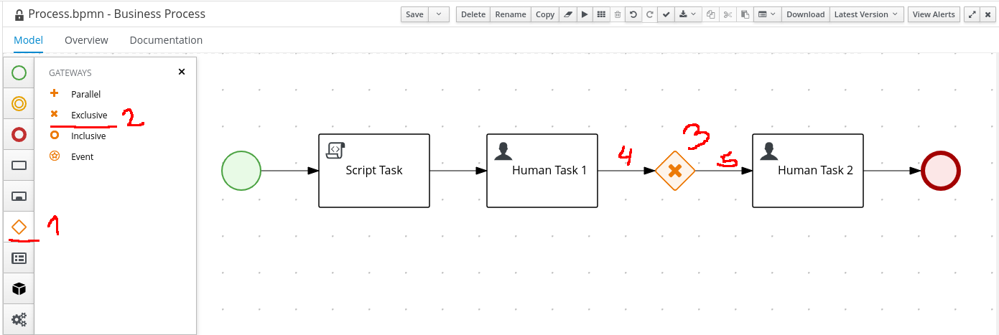
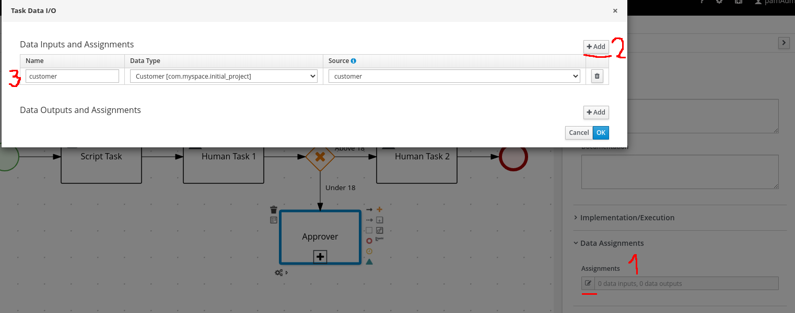

Processo Inicial e Evolução
===========================

Esse é um laboratório para exercitar conceitos e fundamentos de Bussiness Process Management. O processo usará implementações do BPMN2 como User Tasks, Gateways, Sub Processes e Work Item Handlers para integrações externas. Abordará também conceitos do Red Hat Process Automation Manager, que é um motor de processos e regras.

## Objetivos

- Evoluir um processo já existente.
- Implementar gateways.
- Implementar subprocessos.
- Utilizar **Work Item Handler** para integração externa via REST.

## Pré requisitos

- Um ambiente RHPAM disponível e funcional.
- Importar o projeto inicial [Este repositório](https://github.com/gferreir/initial_project_rhpam.git).

Premissas do problema
=====================

Este laboratório terá o objetivo de evoluir um processo para aprovação de um cadastro de cliente.

- Iniciar o processo com algumas informações.
- Na primeira User Task será preenchido o cadastro de um cliente.
- Caso o cliente seja menor de idade (menor do que 18 anos) o processo precisará de aprovação extra, caso contrário terá apenas um revisor para finalizar o processo.
- Para a aprovação extra será iniciado um subprocesso onde terá a aprovação de alguém do grupo de aprovadores.
- Também fará chamadas para uma API Rest para registrar e notificar sobre o cadastro do cliente.

Processo inicial
================

O laboratório partirá do seguinte processo funcional:


O projeto já consta também com os recursos necessários para evolução:


Solução
=======

A partir deste ponto inicia-se o laboratório.

Instalação Work Item Handler Rest
--------------

A primeira tarefa será criar o subprocesso de aprovação extra, para que posteriormente seja inserido no processo principal. Mas como esse subprocesso fará chamadas Rest externas precisamos configurar o RHPAM para tal funcionalidade também.

1. Na página principal do projeto, na parte superior abra as configurações do projeto clicando em **settings**.


2. Clique em **Custom Tasks**.


3. Localize a opção **Rest** e clique no botão azul **Install**.


4. Deixe em branco os campos, e apenas clique em **Install**.


5. Salve as alterações feitas clicando em **Save** e após, clique em **Assets** para voltar para a página inicial do projeto.


Criação Subprocesso
-------------------

Vamos criar o subprocesso de aprovação extra.

### Pré Requisito

- Passo anterior de [Instalação do work item handler rest](#instalação-work-item-handler-rest)

1. Na página inicial do projeto, clique em **Add Asset** no canto superior direito.


2. Na página de assets disponíveis, localize **Business Process** (uma das primeiras opções).


3. No campo **Business Process** preencha com `Process_approver`. Garanta que no campo **Package** esteja a opção `com.myspace.initial_project`.


4. No canto superior direito, clique em **properties** para abrir o painél lateral com as propriedades do processo. No tópico **Process Data** localize a opção de **Process Variables** e adicione as seguintes variáveis de acordo com a tabela:

<table>
<colgroup>
<col style="width: 33%" />
<col style="width: 33%" />
</colgroup>
<tbody>
<tr class="odd">
<td><p>Name</p></td>
<td><p>Data Type</p></td>
</tr>
<tr class="even">
<td><p>customer</p></td>
<td><p>Customer [com.myspace.initial_project.Customer]</p></td>
</tr>
<tr class="odd">
<td><p>isApproved</p></td>
<td><p>Boolean</p></td>
</tr>
<tr class="even">
<td><p>restResult1</p></td>
<td><p>String</p></td>
</tr>
<tr class="odd">
<td><p>restResult2</p></td>
<td><p>String</p></td>
</tr>
<tr class="even">
<td><p>initiator</p></td>
<td><p>String</p></td>
</tr>
</tbody>
</table>


5. Adicione o Start Node que será o ponto de início do processo. No menu lateral esquerdo clique nos **Start Events** e selecione a opção **Start**. Posicione o start node no canvas.


6. Adicione uma User Task para o a aprovação manual. No menu lateral esquerdo clique em **Activities** e selecione a opção **User**. Posicione a User Task no canvas logo após o Start Node.


7. Ligue o Start Node a User Task. Clique no Start Node e selecione a seta contínua e ligue até a User Task.


8. Altere o nome da User Task para melhor identificação. No canvas clique na User Task e no canto superior direito clique no símbolo de lápis (**properties**). No tópico **General** altere o nome para `Approvers`, e logo mais abaixo sob o tópico **Implementation/Execution** altere a Task Name para `Approvers_task`.


9. Adicione para solucionar a User Task. Ainda nas propriedades da User Task, na opção **Actors** clique no ícone de **mais** e no menu **dropdown** clique em **new** e no campo **name** adicione o valor `#{initiator}` e confirme.


10. Adicione as variáveis e instância do objeto para a User Task. Ainda nas propriedades da User Task, na opção **Assignments** clique no símbolo do lápis (Edit). No tópico **Data Inputs and Assignments** clique em **Add** e adicione a seguinte informação:

<table>
<colgroup>
<col style="width: 33%" />
<col style="width: 33%" />
<col style="width: 33%" />
</colgroup>
<tbody>
<tr class="odd">
<td><p>Name</p></td>
<td><p>Data Type</p></td>
<td><p>Source</p></td>
</tr>
<tr class="even">
<td><p>Customer</p></td>
<td><p>Customer [com.myspace.initial_project.Customer]</p></td>
<td><p>customer</p></td>
</tr>
</tbody>
</table>

  * Agora no tópico **Data Outputs and Assignments** clique em **Add** e adicione a segunte informação:

<table>
<colgroup>
<col style="width: 33%" />
<col style="width: 33%" />
<col style="width: 33%" />
</colgroup>
<tbody>
<tr class="odd">
<td><p>Name</p></td>
<td><p>Data Type</p></td>
<td><p>Source</p></td>
</tr>
<tr class="even">
<td><p>Approved</p></td>
<td><p>Boolean</p></td>
<td><p>isApproved</p></td>
</tr>
</tbody>
</table>


11. Configure um prazo para a User Task ser concluída (SLA). Ainda nas propriedades da User Task, na opção **SLA Due Date** coloque o valor `1m` que representa que a User Task possui um SLA de 1 minuto.


12. Vamos criar um Gateway para verificar se a exceção do cadastro foi aprovado. No menu lateral esquerdo clique em **Gateways** e selecione a opção **Exclusive**, a seguir posicione no canvas logo após a User Task e faça a ligação do fluxo da Task anterior para o Gateway.


13. Vamos adicionar um End Node para caso a exceção no casdastro tenha sido negada por algum aprovador. Então caso seja negado o processo deve ser finalizado. No menu lateral esquerdo clique em **End Event** e selecione a opção **End**, a seguir posicione no canvas logo abaixo do Gateway Exclusivo e faça a ligação do fluxo do Gateway anterior para o End Node.


14. Vamos criar um Gateway paralelo para em seguida realizar duas chamadas Rest paralelamente. No menu lateral esquerdo clique em **Gateways** e selecione a opção **Parallel**, a seguir posicione no canvas logo após o Gateway Exclusivo e faça a ligação do fluxo do Gateway anterior para o próximo Gateway.


15. Configure a verificação do Gateway Exclusivo para avaliar se a exceção do cadastro foi negado. Clique na linha do fluxo que liga o Gateway Exclusivo ao End Node e no campo name acrescente `Not Approved`. Mais abaixo no tópico `Implementation/Execution` localize o campo `Process Variable` e selecione a variável `isApproved`, agora no campo `Condition` selecione a opção `Is False` para satisfazer a condição para caso aquela variável seja `false`.


16. Configure a verificação do Gateway Exclusivo para avaliar se a exceção do cadastro foi aprovada. Clique na linha do fluxo que liga o Gateway Exclusivo ao Gateway Paralelo e no campo name acrescente `Approved`. Mais abaixo no tópico `Implementation/Execution` localize o campo `Process Variable` e selecione a variável `isApproved`, agora no campo `Condition` selecione a opção `Is True` para satisfazer a condição para caso aquela variável seja `true`.


17. Adicione dois Work Items Handlers Rest. No menu lateral esquerdo clique em **Custom Tasks** e selecione a opção **Rest**, a seguir posicione no canvas logo após o Gateway Paralelo duas Tasks Rests (conforme imagem abaixo) e faça as ligações dos fluxos a partir do Gateway Paralelo para as duas Tasks Rests.


# <u>**NÃO ESQUEÇA DE IR SALVANDO SEU PROCESSO AO LONGO DO LABORATÓRIO**</u>

18. Vamos nomear a primeira Rest Task para melhor identifica-la. Clique na primeira Rest Task e no menu de Properties ao lado direito, preencha `Register` no campo `Name`.


19. Agora vamos nomear a segunda Rest Task para melhor identifica-la. Clique na segunda Rest Task e no menu de Properties ao lado direito, preencha `Notify` no campo `Name`.


20. Iniciar a configuração das informações para a chamada Rest Register. Clique na Rest Task `Register` e no tópico `Data Assignments` clique no ícone de lápis para abrir o popup de configuração.


21. Preencha com as informações do Backend para que o RHPAM possa realizar a chamada Rest. A aplicação já foi previamente implantada na Cloud, então basta fazer a referência no campo URL.

<table>
<colgroup>
<col style="width: 33%" />
<col style="width: 33%" />
<col style="width: 33%" />
</colgroup>
<tbody>
<tr class="odd">
<td><p>Name</p></td>
<td><p>Data Type</p></td>
<td><p>Source</p></td>
</tr>
<tr class="even">
<td><p>Method</p></td>
<td><p>String</p></td>
<td><p>expression -> GET</p></td>
</tr>
<tr class="odd">
<td><p>Url</p></td>
<td><p>String</p></td>
<td><p>expression -> http://backend-workshop-labs-infra.apps.cluster-92lzq.92lzq.sandbox1899.opentlc.com/resources/register</p></td>
</tr>
<tr class="even">
<td><p>ContentType</p></td>
<td><p>String</p></td>
<td><p>expression -> text/plan</p></td>
</tr>
</tbody>
</table>

  * Agora no tópico **Data Outputs and Assignments** adicione a segunte informação:

<table>
<colgroup>
<col style="width: 33%" />
<col style="width: 33%" />
<col style="width: 33%" />
</colgroup>
<tbody>
<tr class="odd">
<td><p>Name</p></td>
<td><p>Data Type</p></td>
<td><p>Source</p></td>
</tr>
<tr class="even">
<td><p>Result</p></td>
<td><p>String</p></td>
<td><p>restResult1</p></td>
</tr>
</tbody>
</table>


22. Iniciar a configuração das informações para a chamada Rest Notify. Clique na Rest Task `Notify` e no tópico `Data Assignments` clique no ícone de lápis para abrir o popup de configuração.


23. Preencha com as informações do Backend para que o RHPAM possa realizar a chamada Rest. A aplicação já foi previamente implantada na Cloud, então basta fazer a referência no campo URL.

<table>
<colgroup>
<col style="width: 33%" />
<col style="width: 33%" />
<col style="width: 33%" />
</colgroup>
<tbody>
<tr class="odd">
<td><p>Name</p></td>
<td><p>Data Type</p></td>
<td><p>Source</p></td>
</tr>
<tr class="even">
<td><p>Method</p></td>
<td><p>String</p></td>
<td><p>expression -> GET</p></td>
</tr>
<tr class="odd">
<td><p>Url</p></td>
<td><p>String</p></td>
<td><p>expression -> http://backend-workshop-labs-infra.apps.cluster-92lzq.92lzq.sandbox1899.opentlc.com/resources/notify</p></td>
</tr>
<tr class="even">
<td><p>ContentType</p></td>
<td><p>String</p></td>
<td><p>expression -> text/plan</p></td>
</tr>
</tbody>
</table>

  * Agora no tópico **Data Outputs and Assignments** adicione a segunte informação:

<table>
<colgroup>
<col style="width: 33%" />
<col style="width: 33%" />
<col style="width: 33%" />
</colgroup>
<tbody>
<tr class="odd">
<td><p>Name</p></td>
<td><p>Data Type</p></td>
<td><p>Source</p></td>
</tr>
<tr class="even">
<td><p>Result</p></td>
<td><p>String</p></td>
<td><p>restResult2</p></td>
</tr>
</tbody>
</table>


24. Crie um Gateway Inclusivo para receber o fluxo do processo vindo das duas chamadas Redst. No menu lateral esquerdo clique em **Gateways** e selecione a opção **Inclusive**, a seguir posicione no canvas logo após Rest Task Register e faça a ligação dos fluxos vindo das duas Rests Tasks (Register e Notify) para o Gateway Inclusivo.


25. Adicione uma Script Task para imprimir o resultado das chamadas Rests no console. No menu lateral esquerdo clique em **Activities** e selecione a opção **Script**. Posicione a Script Task no canvas logo após do Gateway Inclusivo.


26. Nomeie e configure a Script Task. Clique na Script Task e no menu lateral direito localize o campo `Name`, preencha com `Output Rest`. No tópico `Implementation/Execution` localize o campo e preencha com as seguintes linhas de código:

```Java
System.out.println("Register: "+kcontext.getVariable("restResult1"));
System.out.println("Notify: "+kcontext.getVariable("restResult2"));
```


27. Vamos adicionar um End Node para o final do subprocess. No menu lateral esquerdo clique em **End Event** e selecione a opção **End**, a seguir posicione no canvas logo após a Script Task e faça a ligação do fluxo da Task anterior para o End Node.


28. Gere o formulário para a User Task `Approvers`. Selecione a User Task e clique no ícone logo abaixo do ícone da lixeira.


29. Ao final dessa etapa, o resultado será próximo a esse:


Modificação Processo Principal
-------------------

A ideia principal agora é, modificar o processo principal (já existente no projeto inicial) para que valide se o perfil cadastrado é menor de idade (18). Nesse caso um subprocesso de aprovação extra será executado também.

### Pré Requisito

- Passo anterior de [Instalação do work item handler rest](#instalação-work-item-handler-rest)
- Passo anterior de [Criação de Subprocesso](#criação-subprocesso)

1. O retrato do processo principal incialmente é:


2. As informações sobre o cadastro do perfil é passado na primeira User Task (Human Task 1), então precisamos acrescentar um Gateway após a Task para verificar a idade. Para isso selecione a linha de fluxo que inicialmente conectava a `Human Task 1` à `Human Task 2` e delete-a (tecla DEL).

  * Afaste a User Task `Human Task 2` e o End Node mais para direita para liberar espaço entre as Users Tasks.

  * Crie um Gateway que verificará se a idade é menor do que 18. No menu lateral esquerdo clique em **Gateways** e selecione a opção **Exclusive**, a seguir posicione no canvas logo após a User Task `Human Task 1` e faça a ligação do fluxo da Task anterior para o Gateway, e a seguir ligue também o Gateway Exclusivo para a Human Task 2.



3. Adicione uma Subprocess Task para que depois possamos configurar para utilizar o subprocesso criado nos passos anteriores. No menu lateral esquerdo clique em **SubProcesses** e selecione a opção **Reusable**, a seguir posicione no canvas logo abaixo do Gateway Exclusivo e faça a ligação do fluxo partindo do Gateway para a Subprocess Task.


4. Configure a verificação do Gateway Exclusivo para avaliar se a idade é maior ou igual a 18. Clique na linha do fluxo que liga o Gateway Exclusivo à User Task `Human Task 1` e no campo name acrescente `Above 18`. Mais abaixo no tópico `Implementation/Execution` localize o campo `Process Variable` e selecione a variável `customer.age`, no campo `Condition` selecione a opção `Greater of equal than`, e por fim no campo `Min Value` preencha com o valor 18.


5. Configure a verificação do Gateway Exclusivo para avaliar se a idade é menor do que 18. Clique na linha do fluxo que liga o Gateway Exclusivo ao Subprocess Task e no campo name acrescente `Under 18`. Mais abaixo no tópico `Implementation/Execution` localize o campo `Process Variable` e selecione a variável `customer.age`, no campo `Condition` selecione a opção `Less than`, e por fim no campo `Max Value` preencha com o valor 18.


6. Vamos nomear a Subprocess Task para melhor identifica-la. Clique na primeira Rest Task e no menu de Properties ao lado direito, preencha `Approver` no campo `Name`.


7. Associe o Sub Processo criado anteriormente ao essa Subprocess Task. Ainda nas propriedades do Subprocess Task, no tópcio **Impementation/Execution** localize o combo box de nome `Called Element` e selecione o Sub Processo criado anteriormente. O nome a ser selecionado será `Initial_Project.Process_approver`.


8. Adicione a instância do objeto Customer para que o Sub Processo tenha acesso. Ainda nas propriedades do Subprocess Task, no tópico `Data Assingments` localize o campo **Assignments** e clique no ícone do lápis (Edit). No tópico **Data Inputs and Assignments** clique em **Add** e adicione a seguinte informação:

<table>
<colgroup>
<col style="width: 33%" />
<col style="width: 33%" />
<col style="width: 33%" />
</colgroup>
<tbody>
<tr class="odd">
<td><p>Name</p></td>
<td><p>Data Type</p></td>
<td><p>Source</p></td>
</tr>
<tr class="even">
<td><p>customer</p></td>
<td><p>Customer [com.myspace.initial_project.Customer]</p></td>
<td><p>customer</p></td>
</tr>
</tbody>
</table>



9. Vamos adicionar um End Node para o final do Processo Principal. No menu lateral esquerdo clique em **End Event** e selecione a opção **End**, a seguir posicione no canvas logo abaixo do Subprocess Task e faça a ligação do fluxo da Task anterior para o End Node.


10. Ao final dessa etapa, o resultado será próximo a esse:


Deploy do Projeto
===============================

Faça o build e deploy do projeto.

### Pré Requisito

- Passo anterior de [Instalação do work item handler rest](#instalação-work-item-handler-rest)
- Passo anterior de [Criação de Subprocesso](#criação-subprocesso)
- Passo de [Modificação do Processo Principal](#modificação-processo-principal)

1. Na página inicial do projeto clique em **Deploy**.


2. A mensagem que espera-se ver é de sucesso:


Testar o Projeto (Idade maior do que 18)
===============================

Teste o projeto.

### Pré Requisito

- Passo anterior de [Instalação do work item handler rest](#instalação-work-item-handler-rest)
- Passo anterior de [Criação de Subprocesso](#criação-subprocesso)
- Passo de [Modificação do Processo Principal](#modificação-processo-principal)
- Passo de [Deploy do Projeto](#deploy-do-projeto)

1. Navegue até o dashboards de processo para iniciar o processo principal. No canto superior esquerdo abra o **Menu** e sob o tópico **Manage** clique na opção **Process Definition**.


2. Vamos iniciar o Processo principal. Localize o processo `Process`, selecione o ícone com três pontos e em seguida clique em **Start**


3. Preencha os campos com qualquer informação. Lembrando que o primeiro campo é `String` e o segundo é do tipo `Integer`.


4. Navegue até caixa de tarefas. No canto superior esquerdo abra o **Menu** e sob o tópico **Track** clique na opção **Task Inbox**.


5. Localize a tarefa da **Human Task 1** e clique nela.


6. Clique em **Start** para começar a preencher o formulário da Task.


7. Preencha o formulário de **Customer** com as seguintes informações e após isso clique em **Complete**:

  * `Name`: John Doe
  * `Age`: 20
  * `CelNumber`: 911
  * `Descriptions`:
    * Description 1
    * Description 2


8. Localize a tarefa da **Human Task 2** e clique nela.


9. Clique em **Start** para começar a revisar o formulário da Task.


10. Visualize o formulário e clique em **Complete**.


Testar o Projeto (Idade menor do que 18 e aprovado)
===============================

Teste o processo aprovando a exceção de cadastro.

### Pré Requisito

- Passo anterior de [Instalação do work item handler rest](#instalação-work-item-handler-rest)
- Passo anterior de [Criação de Subprocesso](#criação-subprocesso)
- Passo de [Modificação do Processo Principal](#modificação-processo-principal)
- Passo de [Deploy do Projeto](#deploy-do-projeto)

1. Navegue até o dashboards de processo para iniciar o processo principal. No canto superior esquerdo abra o **Menu** e sob o tópico **Manage** clique na opção **Process Definition**.


2. Vamos iniciar o Processo principal. Localize o processo `Process`, selecione o ícone com três pontos e em seguida clique em **Start**


3. Preencha os campos com qualquer informação. Lembrando que o primeiro campo é `String` e o segundo é do tipo `Integer`.


4. Navegue até caixa de tarefas. No canto superior esquerdo abra o **Menu** e sob o tópico **Track** clique na opção **Task Inbox**.


5. Localize a tarefa da **Human Task 1** e clique nela.


6. Clique em **Start** para começar a preencher o formulário da Task.


7. Preencha o formulário de **Customer** com as seguintes informações e após isso clique em **Complete**:

  * `Name`: John Doe
  * `Age`: 16
  * `CelNumber`: 911
  * `Descriptions`:
    * Description 1
    * Description 2


8. Navegue até caixa de tarefas. No canto superior esquerdo abra o **Menu** e sob o tópico **Track** clique na opção **Task Inbox**.


9. Localize a tarefa da **Approvers** e clique nela.


10. Clique no botão **Claim** para assignar a tarefa para o seu usuário.


11. Clique no botão **Start** para iniciar a tarefa.


12. Assinale o checkbox **Approved** e clique em **Complete** para finalizar a task.


13. Visualize os logs do Kie-Server com as impressões com os retornos das chamadas Rests.


Testar o Projeto (Idade menor do que 18 e recusado)
===============================

Você pode testar também o processo porém recusando a aprovação extra.

### Pré Requisito

- Passo anterior de [Instalação do work item handler rest](#instalação-work-item-handler-rest)
- Passo anterior de [Criação de Subprocesso](#criação-subprocesso)
- Passo de [Modificação do Processo Principal](#modificação-processo-principal)
- Passo de [Deploy do Projeto](#deploy-do-projeto)

1. Navegue até o dashboards de processo para iniciar o processo principal. No canto superior esquerdo abra o **Menu** e sob o tópico **Manage** clique na opção **Process Definition**.


2. Vamos iniciar o Processo principal. Localize o processo `Process`, selecione o ícone com três pontos e em seguida clique em **Start**


3. Preencha os campos com qualquer informação. Lembrando que o primeiro campo é `String` e o segundo é do tipo `Integer`.


4. Navegue até caixa de tarefas. No canto superior esquerdo abra o **Menu** e sob o tópico **Track** clique na opção **Task Inbox**.


5. Localize a tarefa da **Human Task 1** e clique nela.


6. Clique em **Start** para começar a preencher o formulário da Task.


7. Preencha o formulário de **Customer** com as seguintes informações e após isso clique em **Complete**:

  * `Name`: John Doe
  * `Age`: 16
  * `CelNumber`: 911
  * `Descriptions`:
    * Description 1
    * Description 2


8. Navegue até caixa de tarefas. No canto superior esquerdo abra o **Menu** e sob o tópico **Track** clique na opção **Task Inbox**.


9. Localize a tarefa da **Approvers** e clique nela.


10. Clique no botão **Claim** para assignar a tarefa para o seu usuário.


12. Clique no botão **Start** para iniciar a tarefa.


13. **Não** assinale o checkbox **Approved** e clique em **Complete** para finalizar a task.


Versão finalizada
===============================

A versão final desse laboratório pode ser encontrado nesse [repositório](https://github.com/gferreir/backend_quarkus_workshop). Caso não tenha conseguido finalizar todos os processos e queira verificar a versão final, apenas importe o repositório citado acima.